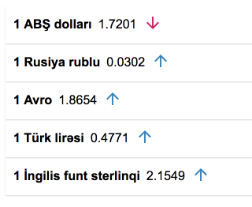
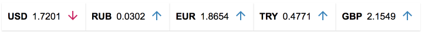

# react-cbar / AZN Məzənnələri
Azərbaycan Respublikasının Mərkəzi Bankı https://cbar.az

val = (cbar.az-da olan bütün məzənnələr)
```
<Widget val="USD,RUB,EUR,TRY,GBP" names />
```

**Əlavələr**

```horizontal``` - Üfüqi


```names```- Kod yerinə adlar

Misal üçün
```
<Widget val="USD,RUB,EUR,TRY" horizontal />
```



React, ReactDOM CDN-dən götürülür.
